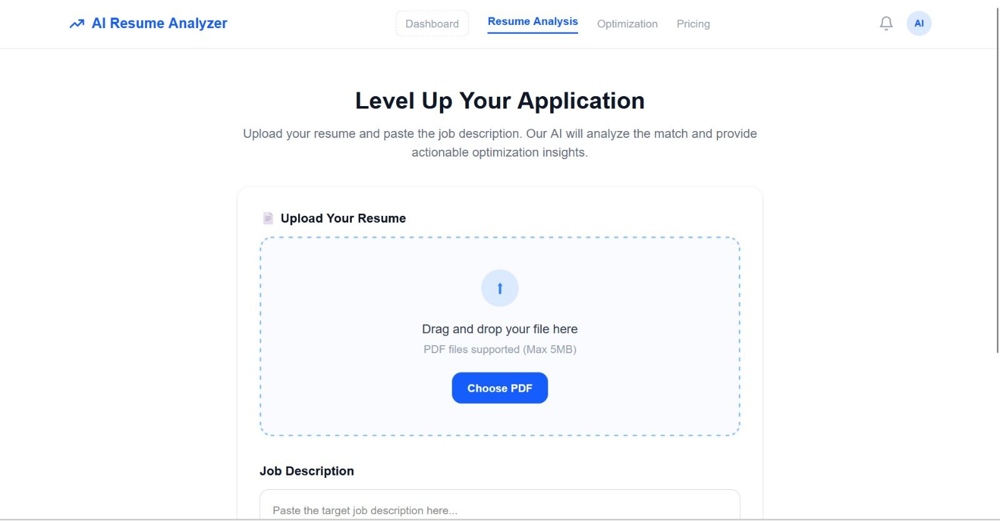
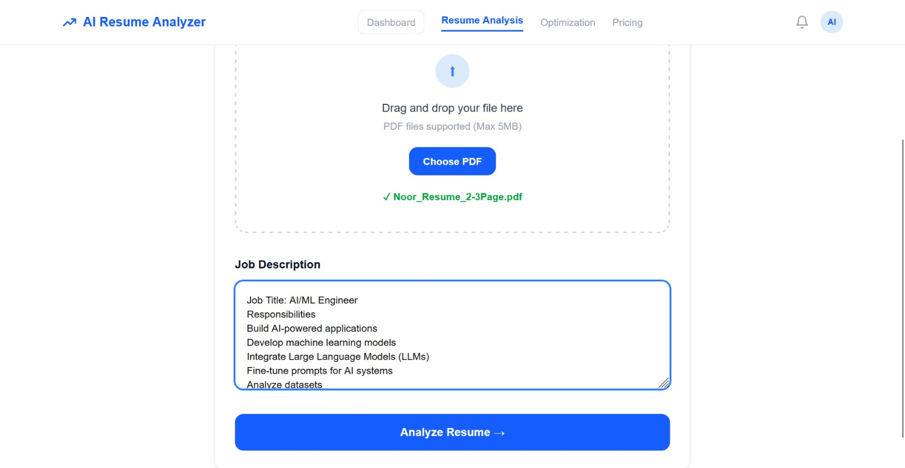
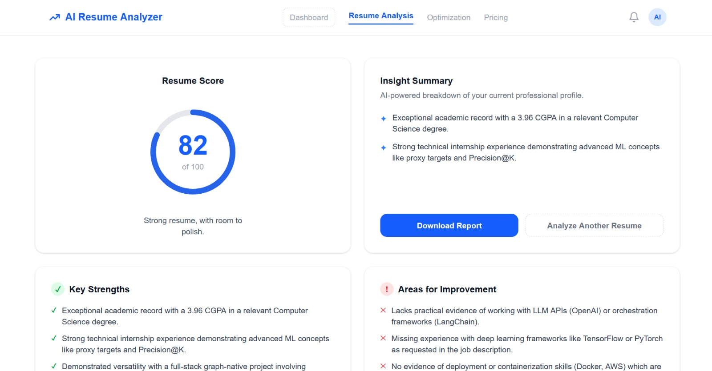
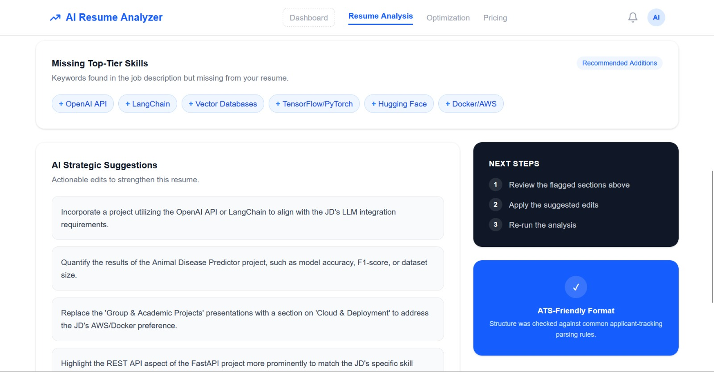
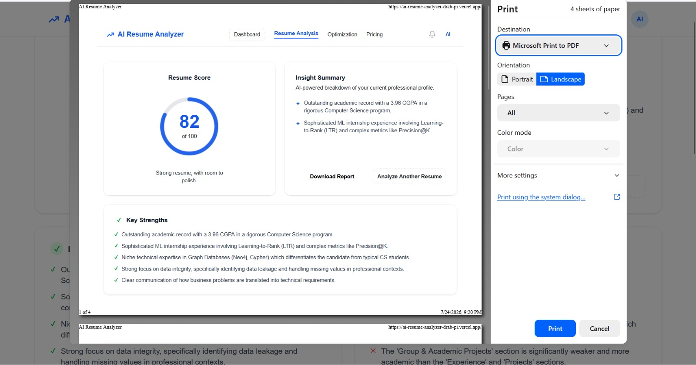

# AI Resume Analyzer


**Live Demo:** [ai-resume-analyzer-drab-pi.vercel.app](https://ai-resume-analyzer-drab-pi.vercel.app)
**Repository:** [github.com/Noor-Fatima-Shahid/AI_Resume_Analyzer](https://github.com/Noor-Fatima-Shahid/AI_Resume_Analyzer)

---

## Project Overview

**AI Resume Analyzer** lets a user upload their resume (PDF) and paste a real job description. The app then uses AI to score the resume, compare it directly against the job requirements, and return specific, actionable feedback — not generic tips, but suggestions that reference the user's actual resume content and the actual job posting.

## Problem Statement

Job seekers — especially students and early-career applicants — often have no idea whether their resume will actually pass an Applicant Tracking System (ATS) or match a specific job posting before they hit "Apply." Most resume advice online is generic and doesn't reference the applicant's actual content or the specific job they're targeting. Paid career coaching isn't accessible to most students, and free tools online are often static keyword checkers with no real understanding of context.

**Who it's for:** Students and job seekers — including myself, while applying for ML/AI internships — who want to optimize a resume for a specific role before submitting it, using their own real resume and real job descriptions rather than generic advice.

## Features

- **PDF Resume Upload** — drag-and-drop or file picker, supports PDF up to 5MB
- **Job Description Matching** — paste any job description to get a tailored, JD-specific analysis
- **Resume Score (0–100)** — an overall quality/match score with a visual score ring
- **Key Strengths** — concrete strengths pulled directly from the resume content
- **Areas for Improvement** — specific weaknesses flagged for the candidate to fix
- **Missing Top-Tier Skills** — keywords/skills present in the job description but absent from the resume
- **AI Strategic Suggestions** — actionable, resume-specific edits (e.g. "quantify the results of Project X")
- **Download Report** — export the analysis results
- **Analyze Another Resume** — re-run the flow without reloading the app

## Tech Stack

**Frontend**
- Next.js
- React
- TypeScript
- Tailwind CSS

**Backend**
- Next.js API Routes

**AI**
- Google Gemini API

**PDF Processing**
- pdf-parse

**Deployment**
- Vercel

**Version Control**
- Git + GitHub

## AI Workflow

The core AI feature is a **resume-to-job-description matching and scoring engine** powered by the Gemini API. When a user submits their resume text (extracted from the uploaded PDF) and, optionally, a job description, the AI:

1. Evaluates overall resume quality
2. Scores how well the resume matches the specific job description (if provided)
3. Extracts concrete strengths and weaknesses from the actual resume content
4. Identifies missing skills/keywords relevant to the job description
5. Generates specific, actionable suggestions referencing the resume's real content

The AI is instructed to return **strictly structured JSON** (no markdown, no extra commentary) so the frontend can render it directly into the score ring, strengths/weaknesses lists, and suggestion cards. It also follows a fixed scoring rubric and consistency rules so the same resume doesn't get wildly different scores on repeated runs.

The complete system prompt is available in: `src/lib/prompt.ts`

**Key excerpt:**

```
You are an expert ATS resume reviewer, recruiter, and career coach.

You will receive:
1. The text extracted from a candidate's resume.
2. Optionally, a job description.

SCORING RULES
- Use the scoring rubric above.
- Evaluate the same resume consistently.
- Determine strengths and weaknesses BEFORE assigning the score.
- Base the score only on the actual resume content. Do not invent information.

Return ONLY valid JSON:
{
  "score": 0,
  "strengths": [],
  "weaknesses": [],
  "missingSkills": [],
  "suggestions": []
}
```

## Screenshots

**1. Landing / Upload screen — empty state**



**2. Resume uploaded + job description filled in**



**3. Analysis results — score, strengths, and areas for improvement**



**4. Missing skills & AI strategic suggestions**



**5. Download Report**




## Project Structure

```
src/
 app/
 components/
 lib/
 public/

README.md
package.json
```

## How to Run

1. **Clone the repository**
   ```bash
   git clone https://github.com/Noor-Fatima-Shahid/AI_Resume_Analyzer.git
   cd AI_Resume_Analyzer
   ```

2. **Install dependencies**
   ```bash
   npm install
   ```

3. **Set up environment variables**

   Create a `.env.local` file in the project root and add:
   ```
   GEMINI_API_KEY=your_gemini_api_key_here
   ```
   Get a free Gemini API key from [Google AI Studio](https://aistudio.google.com/).

4. **Run the development server**
   ```bash
   npm run dev
   ```

5. Open [http://localhost:3000](http://localhost:3000) in your browser.

## Known Limitations

- Scanned/image-only PDFs cannot be analyzed because no OCR is implemented.
- Multi-column resumes may extract text imperfectly.
- AI responses can vary slightly between analyses.
- Requires a valid Gemini API key and available quota.

## Future Improvements

- OCR support for scanned resumes
- Real ATS formatting analysis
- Authentication and saved resume history
- Multiple resume comparison
- Cover letter generation

## Live Demo

[https://ai-resume-analyzer-drab-pi.vercel.app](https://ai-resume-analyzer-drab-pi.vercel.app)

## Repository

[https://github.com/Noor-Fatima-Shahid/AI_Resume_Analyzer](https://github.com/Noor-Fatima-Shahid/AI_Resume_Analyzer)

## Author

Noor Fatima Shahid
